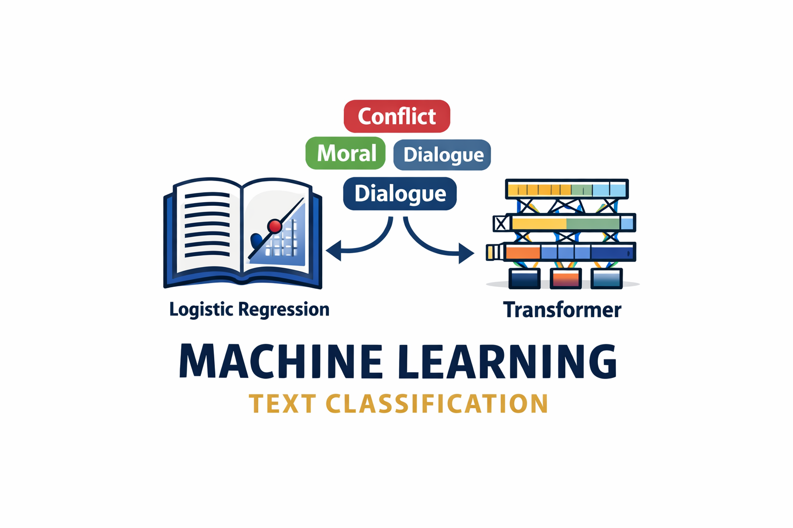

  

# Multilabel discriminative modeling on TinyStories dataset

## Overview

This repository contains the implementation and evaluation of discriminative supervised models for **multilabel text classification** on the [TinyStories dataset]([https://huggingface.co/datasets/roneneldan/TinyStories](https://huggingface.co/datasets/skeskinen/TinyStories-GPT4)).

The [project](projectFinal.py) focuses on comparing a **traditional linear classifier**, the Logistic Regression, with a **Transformer-based model**, DistilBERT. Differences in representation power, performance and computational cost are highlighted, and the full theoretical background, model architectures and experimental results are described in:

* [Report](report.pdf) → Comprehensive description of the models, dataset, training strategy and evaluation metrics.

## Summary

Text Classification is a core task in Natural Language Processing, with applications ranging from information retrieval to sentiment analysis. In this work, the task of **supervised multilabel text classification** is addressed using **discriminative models**, where each label is treated as an independent binary classification problem.

The TinyStories dataset consists of short children stories annotated with zero or more semantic tags from a fixed set of six classes:
**BadEnding, Conflict, Dialogue, Foreshadowing, MoralValue, Twist**.

Two discriminative approaches are implemented and compared:

* **Logistic Regression**, serving as a strong linear baseline.
* **DistilBERT**, a Transformer-based model **fine-tuned** on TinyStories, capable of capturing richer semantic representations.

Both models are trained, validated and evaluated using consistent data splits and metrics, including **accuracy**, **per-label F1 score**, **ROC curves** and **AUC**, with optimized per-class decision thresholds to address label imbalance.

## Dataset and training strategy

* Dataset split:

  * Training set: 50,000 stories
  * Test set: 10,000 stories
* Training set is further divided into:

  * Training subset: 40,000 stories
  * Validation set: 10,000 stories
* Labels are encoded using **multi-hot vectors** via `MultiLabelBinarizer`.

This setup ensures reliable performance estimation while keeping computational time manageable.

## Code execution modes

The code supports two execution modes that control which stages of the pipeline are executed:

* **`TEST`** (default) $\rightarrow$ Loads pre-trained model parameters and directly evaluates the model on the test set.
  This mode allows the test phase to be run as a standalone execution without retraining.

* **`TRAIN`** $\rightarrow$ Enables full training, validation and testing of the models, while saving the updated model parameters.

The execution mode is controlled via the `set_mode` function, which is called multiple times throughout the code to manage the workflow for each model.
